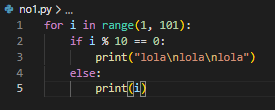
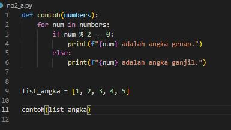
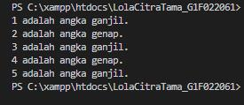
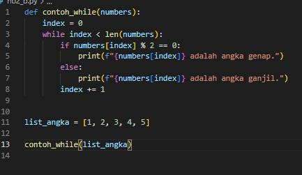
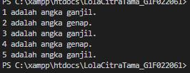
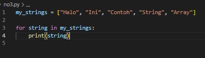

# _Tugas Pemrograman Berbasis Objek_

## 1. _Buatlah perulangan hingga 100 menggunakan Python_

#### Luaran

1
2
3
4
5
6
7
8
9
lola 
lola 
lola 
11
12
13
14
15
16
17
18
19
lola 
lola  
lola 
21
22
23
24
25
26
27
28
29
lola 
lola 
lola 
31
32
33
34
35
36
37
38
39
lola 
lola 
lola 
41
42
43
44
45
46
47
48
49
lola 
lola 
lola 
51
52
53
54
55
56
57
58
59
lola 
lola 
lola 
61
62
63
64
65
66
67
68
69
lola 
lola 
lola 
71
72
73
74
75
76
77
78
79
lola 
lola 
lola 
81
82
83
84
85
86
87
88
89
lola 
lola 
lola 
91
92
93
94
95
96
97
98
99
lola 
lola 
lola 

#### Penjelasan

-       for i in range(1, 101):
Ini adalah perulangan for yang akan mengiterasi nilai variabel i dari 1 hingga 100 pada setiap iterasi.

-       if i % 10 == 0:
Pernyataan if memeriksa apakah nilai i habis dibagi 10 tanpa sisa (i % 10 == 0), menandakan bahwa i adalah kelipatan 10.

-       print("lola\nlola\nlola")
Jika i adalah kelipatan 10, maka cetak tiga baris "lola".

-       else:
Jika i bukan kelipatan 10, maka masuk ke blok else.

-       print(i)
Jika i bukan kelipatan 10, cetak nilai i.

## 2. _ Buatlah program bebas, dengan menerapkan if else pada :_
### a. _For Loops_
For loops dalam Python digunakan untuk mengulangi (iterasi) suatu blok kode sejumlah tertentu kali atau melalui setiap elemen dalam suatu urutan (seperti daftar, tupel, atau string). Ini memungkinkan kita menjalankan serangkaian pernyataan untuk setiap elemen atau iterasi yang ada.

### Luaran

### Penjelasan

-       def contoh(numbers):
Mendefinisikan fungsi contoh yang menerima parameter numbers, yaitu sebuah list angka.

-       for num in numbers:
Pernyataan for yang mengiterasi melalui setiap nilai dalam list numbers.

-       if num % 2 == 0:
Pernyataan if memeriksa apakah nilai num habis dibagi 2 tanpa sisa, menandakan bahwa num adalah angka genap.

-       print(f"{num} adalah angka genap.")
Jika num adalah angka genap, cetak pesan yang menyatakan bahwa angka tersebut genap.

-       else:
Blok else yang terkait dengan blok if. Jika kondisi pada if tidak terpenuhi (angka ganjil), maka program akan masuk ke blok else.

-       print(f"{num} adalah angka ganjil.")
Cetak pesan bahwa angka tersebut ganjil.

-       list_angka = [1, 2, 3, 4, 5]
Mendefinisikan list angka [1, 2, 3, 4, 5].

-       contoh(list_angka)
Pemanggilan fungsi contoh dengan menggunakan list angka [1, 2, 3, 4, 5] sebagai argumen.

### b. _While Loops_
While loop adalah struktur kontrol perulangan pada pemrograman yang menjalankan serangkaian pernyataan atau blok kode selama suatu kondisi bernilai benar (True). Perbedaannya dengan for loop yang biasanya digunakan untuk iterasi melalui sejumlah elemen dalam rangkaian atau urutan, while loop akan terus berulang selama kondisi yang diberikan tetap benar.

#### Luaran
Output yang dihasilkan dari kode ini akan sama dengan output dari perulangan For sebelumnya

### Penjelasan

-       def contoh_while(numbers):
Mendefinisikan fungsi contoh_while yang menerima parameter numbers, yaitu sebuah list angka.

-       index = 0
Inisialisasi variabel index dengan nilai awal 0. Variabel ini digunakan untuk melacak indeks saat ini dalam list.

-       while index < len(numbers):
Pernyataan while yang akan terus berjalan selama nilai index kurang dari panjang (jumlah elemen) dari list numbers.

-       if numbers[index] % 2 == 0:
Pernyataan if memeriksa apakah nilai dalam list pada indeks saat ini (numbers[index]) habis dibagi 2 tanpa sisa, menandakan bahwa angka tersebut adalah angka genap.

-       print(f"{numbers[index]} adalah angka genap.")
Jika angka pada indeks saat ini adalah angka genap, cetak pesan yang menyatakan bahwa angka tersebut genap.

-       else:
Blok else yang terkait dengan blok if. Jika kondisi pada if tidak terpenuhi (angka ganjil), maka program akan masuk ke blok else.

-       print(f"{numbers[index]} adalah angka ganjil.")
Cetak pesan bahwa angka pada indeks saat ini adalah angka ganjil.

-       index += 1
Meningkatkan nilai index untuk melanjutkan ke elemen berikutnya dalam list.

-       list_angka = [1, 2, 3, 4, 5]
Mendefinisikan list angka [1, 2, 3, 4, 5].

-       contoh_while(list_angka)
Pemanggilan fungsi contoh_while dengan menggunakan list angka [1, 2, 3, 4, 5] sebagai argumen.

## 3. _ Buatlah sebuah variabel dengan tipe data array, kemudian tampilkan semua nilai dalam variabel tersebut menggunakan perulangan for _

### Luaran

-       my_strings = ["Halo", "Ini", "Contoh", "String", "Array"]
Membuat variabel my_strings dengan tipe data array (list) yang berisi beberapa string.

-       for string in my_strings:
Pernyataan for yang mengiterasi melalui setiap nilai (string) dalam list my_strings.

-       print(string)
Mencetak setiap string dalam list menggunakan pernyataan print().